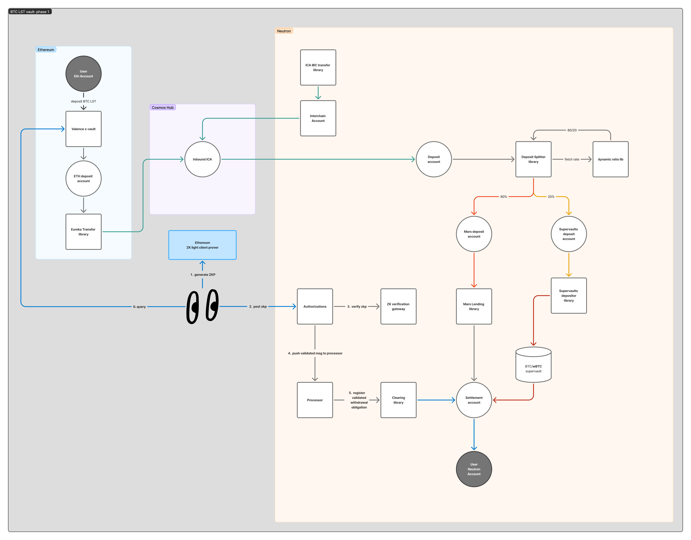
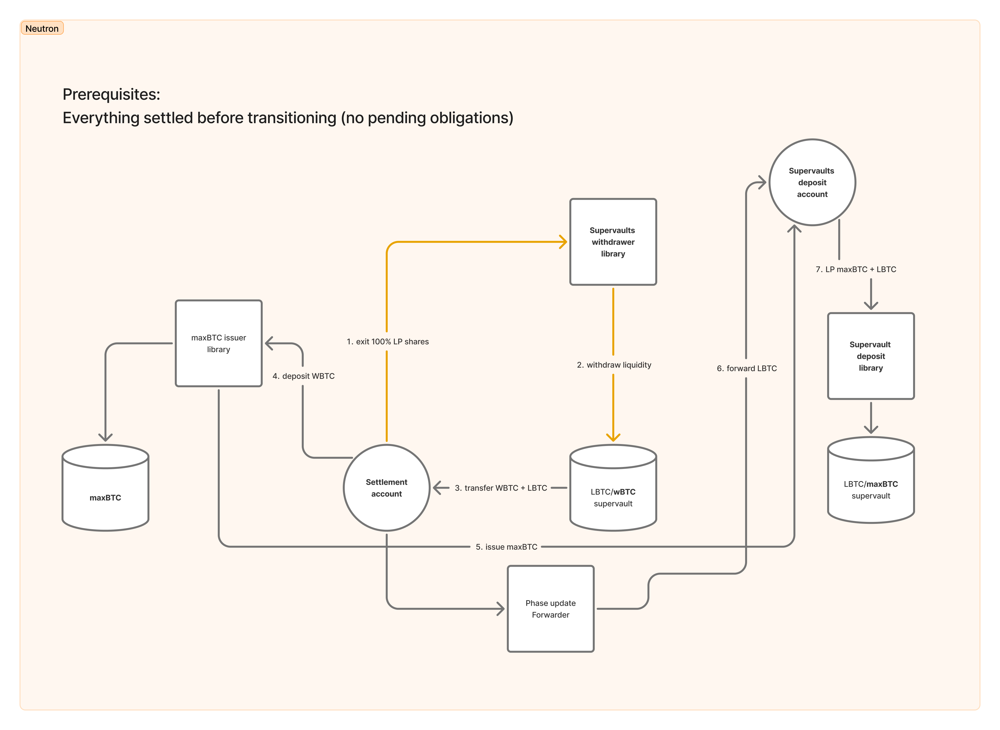
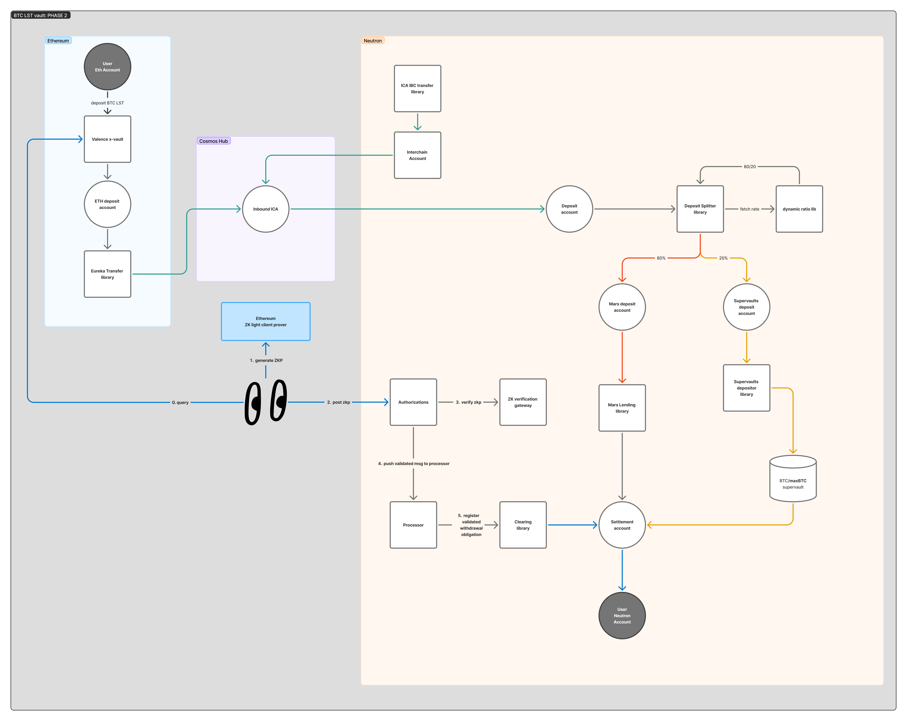

# BTC LST Vault

This vault is meant for BTC LST tokens that are transferred directly from Ethereum to the Cosmos Hub (Gaia) using IBC Eureka without going through an intermediate domain. Examples of these would be pumpBTC, brBTC, solvBTC... except LBTC (lombard BTC) and WBTC. These last two are special cases that have unique vaults.

The vault consists of two phases with the following characteristics.

- Phase 1 (pre maxBTC): the underlying supervault pairs the BTC LST with WBTC.
- Phase 2 (maxBTC available): the underlying supervault pairs the BTC LST with maxBTC and the previous position is migrated to the new supervault.

## Phase 1 flow

### Deposit

1. Users deposit the BTC LST in the vault contract on Ethereum and get vault shares.
2. The strategist executes the coprocessor which returns a ZK proof and posts it to the authorization contract on Ethereum that triggers an Eureka Transfer with an empty memo on the IBCEurekaTransfer library which sends all the deposited BTC LST from Ethereum to an ICA on Gaia. This is done with ZK because we are forcing an empty memo to avoid extra hops on the destination chain and to hardcode a max bridge fee amount.
3. Once funds arrive, the strategist executes an IBC transfer authorization that transfers the assets from the ICA to the deposit account on Neutron.
4. Once funds are in the deposit account, the strategist executes a split+lend+deposit authorization that lends part of the tokens into a Mars position and deposits the other part in a supervault, sending the LP tokens to the Settlement account

### Withdraw

1. User requests a withdraw on Ethereum. This withdraw request is stored in the contract state with the current redemption rate and the amount of shares burned.
2. The strategist executes the coprocessor which returns a ZK proof after doing state proof verification of the vault contract on Ethereum. This proof contains, as public inputs, the amount of tokens that the user will get.
3. The strategist posts the proof to the authorization contract on Neutron, which executes a `register_obligation` message on the clearing queue. This library splits the amount that the user should get in BTC LST into an array of BTC LST tokens and LP supervaults according to the settlement ratio.
4. The strategist withdraws enough tokens from the Mars lending position to pay the user from the settlement account.
5. The strategist triggers the obligation settlement on the clearing queue library and user gets the funds from the settlement account.

Here is a general diagram of the flow during phase 1:

## Phrase transition

**NOTES**:
Before triggering the phase transition, the strategist must settle all current obligations.
This transition is executed by the program owner in a single authorization execution.

The program owner will execute the phase shift authorization with the following actions:

1. Withdraw all liquidity from the BTCLST/wBTC supervault
2. Update the maxBTC issuer library with the correct maxBTC contract address.
3. Issue maxBTC, which will consume all wBTC and mint maxBTC that is sent to the supervault deposit account.
4. Forward the BTCLST using the phase shift forwarder from the settlement account to the supervault deposit account.
5. Update supervault deposit library config with the new supervault (BTCLST/maxBTC) information.
6. Update clearing queue library config with the new supervault information.
7. Provide liquidity to the supervault with the maxBTC and BTCLST that are sitting in the supervault deposit account.

Here is a diagram of the phase transition:

## Phase 2 flow

The phase 2 flow is exactly the same as phase 1 but now instead of depositing into a BTCLST/wBTC supervault we deposit into a BTCLST/maxBTC one.

Here is a diagram for phase 2:

