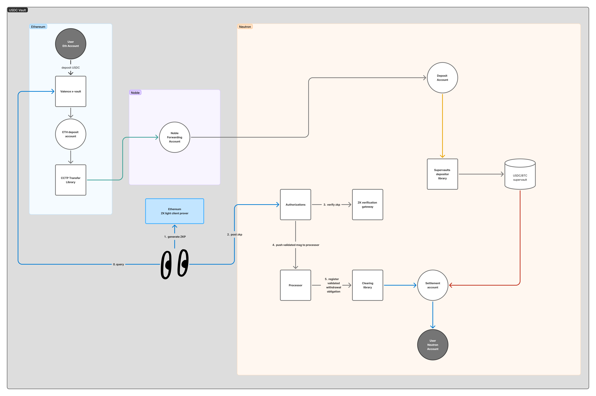

# USDC LP Vault

This vault is for USDC tokens that are transferred from Ethereum to Neutron via Noble using CCTP. This is done using a CCTPTransfer library that transfers to a forwarding account on Noble that automatically IBCs the funds to the Neutron deposit account upon receiving the USDC.

This vault has no phase transitions and operates in the following manner:

### Deposit

1. Users deposit the USDC in the vault contract on Ethereum and get vault shares.
2. The strategist executes the transfer authorization on the authorization contract that triggers the transfer on the CCTPTransfer library.
3. Once funds are in the deposit account, the strategist executes a deposit authorization that deposits the USDC in the USDC/BTC supervault, sending the LP tokens to the Settlement account

### Withdraw

1. User requests a withdraw on Ethereum. This withdraw request is stored in the contract state with the current redemption rate and the amount of shares burned.
2. The strategist executes the coprocessor which returns a ZK proof after doing state proof verification of the vault contract on Ethereum. This proof contains, as public inputs, the amount of tokens that the user will get.
3. The strategist posts the proof to the authorization contract on Neutron, which executes a `register_obligation` message on the clearing queue. This library calculates how many LP tokens the user will get according to current price by querying the supervault.
4. The strategist triggers the obligation settlement on the clearing queue library and user gets the corresponding LP shares from the settlement account.

Here is a general diagram of the flow:

