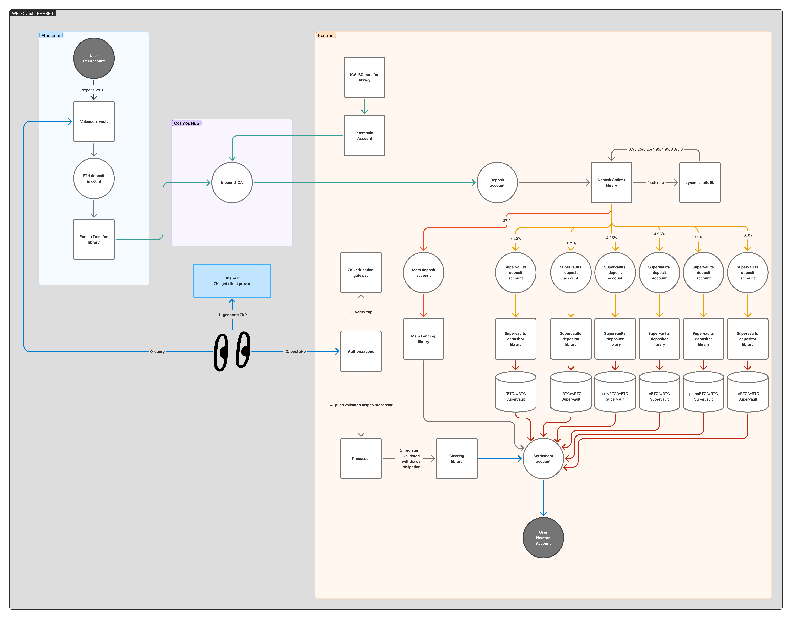
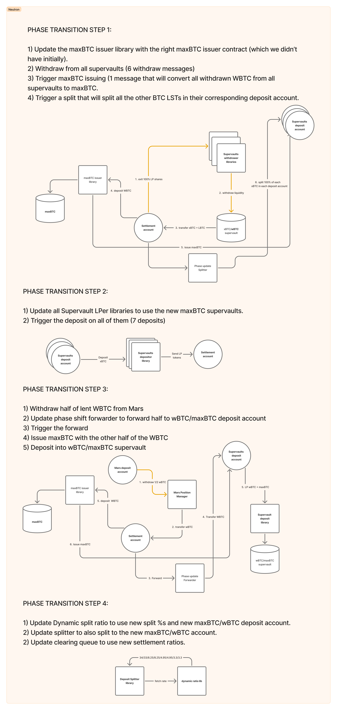
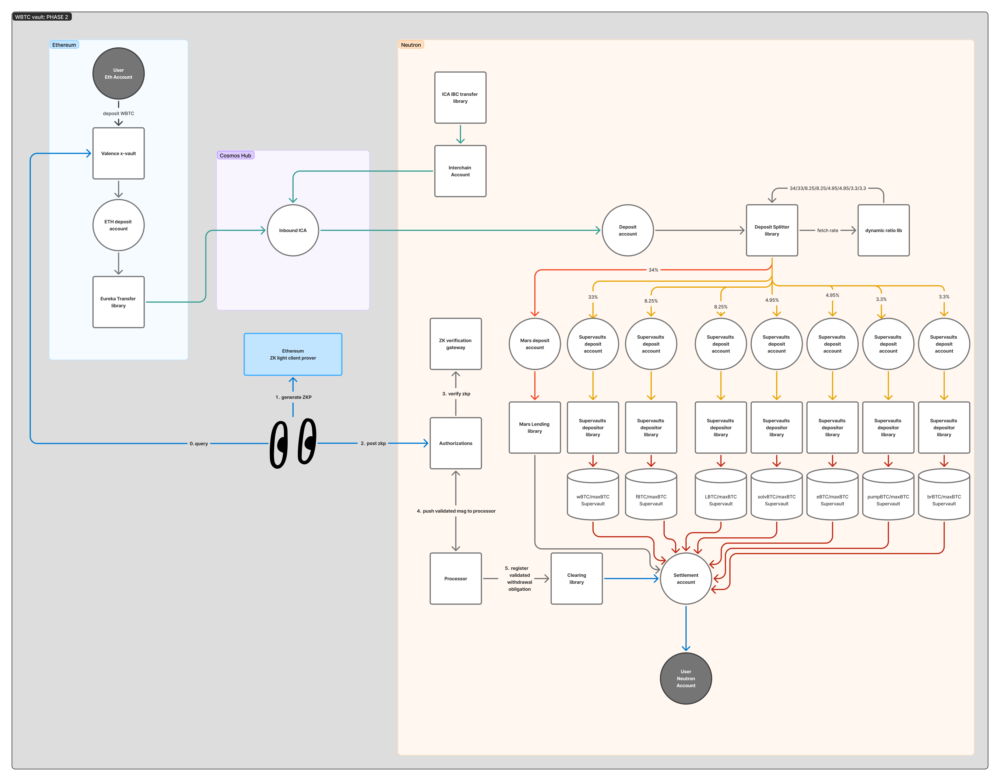

# wBTC Vault

This vault is for wBTC tokens that are transferred directly from Ethereum to the Cosmos Hub (Gaia) using IBC Eureka without going through an intermediate domain.

The vault consists of two phases with the following characteristics.

- Phase 1 (pre maxBTC): the wBTC is paired with several other BTC LSTs in multiple supervaults (6 supervaults in total).
- Phase 2 (maxBTC available): the wBTC is paired with all the previous BTC LSTs but also with maxBTC (7 supervaults in total).

## Phase 1 flow

### Deposit

1. Users deposit the wBTC in the vault contract on Ethereum and get vault shares.
2. The strategist executes the coprocessor which returns a ZK proof and posts it to the authorization contract on Ethereum that triggers an Eureka Transfer with an empty memo on the IBCEurekaTransfer library which sends all the deposited wBTC from Ethereum to an ICA on Gaia. This is done with ZK because we are forcing an empty memo to avoid extra hops on the destination chain and to hardcode a max bridge fee amount.
3. Once funds arrive, the strategist executes an IBC transfer authorization that transfers the assets from the ICA to the deposit account on Neutron.
4. Once funds are in the deposit account, the strategist executes a split+lend+6deposit authorization that lends part of the tokens into a Mars position and deposits the rest in multiple supervaults, sending the LP tokens to the settlement account.

### Withdraw

1. User requests a withdraw on Ethereum. This withdraw request is stored in the contract state with the current redemption rate and the amount of shares burned.
2. The strategist executes the coprocessor which returns a ZK proof after doing state proof verification of the vault contract on Ethereum. This proof contains, as public inputs, the amount of tokens that the user is entitled to.
3. The strategist posts the proof to the authorization contract on Neutron, which executes a `register_obligation` message on the clearing queue. This library splits the amount that the user should get in wBTC into an array of wBTC tokens and supervaults LP tokens according to settlement ratios.
4. The strategist withdraws enough tokens from the Mars lending position to pay the user from the settlement account.
5. The strategist triggers the obligation settlement on the clearing queue library and user gets the funds from the settlement account.

Here is a general diagram of the flow during phase 1:

## Phrase transition

**NOTES**:
Before triggering the phase transition, the strategist must settle all current obligations.
This transition is executed by the program owner in multiple authorization transactions due to its complexity.

Here is a diagram of how the phase transition looks like for each step:

## Phase 2 flow

The phase 2 flow is very similar to phase 1 except that there is an additional deposit to a wBTC/maxBTC supervault. Now the strategist will execute
7 deposit messages instead of 6.

Here is a diagram for phase 2:

